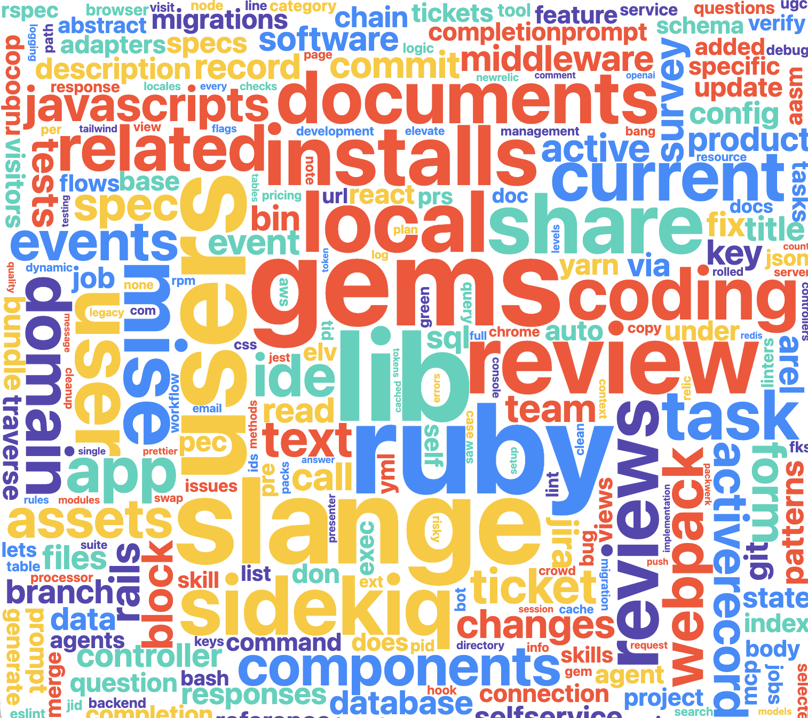

# Claude Code Word Cloud

Generates a word cloud from your local Claude Code conversation history.

## TL;DR

```bash
./start.sh
```



## Requirements

- Python 3 (stdlib only — no pip install needed)
- [Claude Code](https://claude.ai/code) with at least some conversation history saved at `~/.claude/projects/`

## Usage

```bash
# 1. Generate word frequencies from your history
python3 generate.py

# 2. Serve locally (required — fetch won't work over file://)
python3 -m http.server 8000

# 3. Open in browser
open http://localhost:8000
```

That's it. `generate.py` reads from `~/.claude/projects/**/*.jsonl` automatically — no configuration needed.

## Output

- `words.json` — top 300 words by frequency (regenerate anytime to pick up new conversations)
- `index.html` — the word cloud visualization (no rebuild needed)
